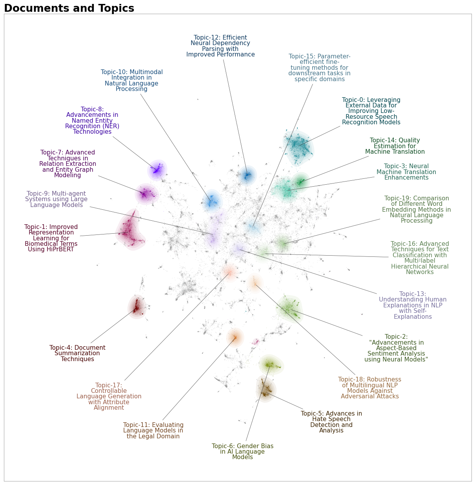

# Text Clustering and Topic Modeling using UMAP, HDBSCAN, and BERTopic


## Overview

This project utilizes **text clustering** and **topic modeling** techniques to analyze a dataset of abstracts and titles. It groups similar documents into clusters and identifies the underlying topics within the dataset. The project uses various tools such as **Sentence-Transformers** for text embedding, **UMAP** for dimensionality reduction, **HDBSCAN** for clustering, and **BERTopic** for topic modeling.

### Key Features:
- **Text Embedding**: Transforms text data (abstracts) into embeddings using the `Sentence-Transformer` model.
- **Dimensionality Reduction**: Reduces the dimensionality of the embeddings using **UMAP** for better visualization and clustering.
- **Clustering**: Groups the reduced embeddings using **HDBSCAN** to identify dense regions of related topics.
- **Topic Modeling**: Applies **BERTopic** to model and visualize topics within the dataset.

## Requirements

The following libraries are required to run the code:
- `datasets`
- `sentence_transformers`
- `umap-learn`
- `hdbscan`
- `pandas`
- `numpy`
- `bertopic`

You can install all dependencies using:

pip install datasets sentence-transformers umap-learn hdbscan pandas numpy bertopic




# Text Clustering and Topic Modeling using UMAP, HDBSCAN, and BERTopic

## Use Cases and Benefits of Text Clustering

Text clustering and topic modeling are crucial techniques in **Natural Language Processing (NLP)**, especially for organizing large volumes of unstructured text data. Here are some examples of how text clustering can be beneficial:

### 1. **Twitter Sentiment Analysis:**
   Text clustering helps group tweets based on topics and sentiment. For instance, tweets about a particular event (like a sports match or a product launch) can be grouped together, making sentiment analysis more meaningful.
   
   By clustering tweets into related groups, you can detect trending topics, monitor public opinion, and track sentiment over time. This can help brands and organizations understand how the public feels about certain events, products, or services.

### 2. **Document Organization:**
   Clustering techniques help automatically categorize large document collections. For example, articles, research papers, or news items can be clustered based on their content, making it easier for users to browse related topics.
   
   In legal or academic fields, clustering can assist in organizing documents into specific categories for easier retrieval.

### 3. **Improving Search Results:**
   By clustering content around key topics, you can enhance search engines by categorizing results according to specific themes, improving the relevance of search results.
   
   For example, clustering documents related to machine learning can ensure that a user gets more targeted results when searching for ML-related content.

### 4. **Customer Feedback Analysis:**
   Text clustering can be used to analyze customer feedback or reviews. By grouping similar feedback, you can detect recurring themes or issues, such as complaints about a particular feature of a product or praise for a specific service.
   
   This can be particularly useful for companies seeking to improve customer satisfaction by focusing on areas that matter most to their customers.

### 5. **Content Recommendation:**
   In content-heavy platforms like news websites, blogs, or social media, text clustering can group related articles together, improving content recommendations for users.
   
   For instance, if a user reads an article about a specific political event, the system can recommend other articles from the same cluster, ensuring relevant and personalized content delivery.

## Code Walkthrough

### Step 1: Load and Preprocess the Data
The dataset is loaded, and text data (abstracts) is prepared for further processing.

### Step 2: Create Text Embeddings
Text data (abstracts) is encoded into vector representations using a pre-trained embedding model, which allows the text to be compared and grouped efficiently.

### Step 3: Reduce Dimensions with UMAP
UMAP is used to reduce the dimensionality of the text embeddings, making it easier to visualize and cluster the data.

### Step 4: Cluster with HDBSCAN
HDBSCAN is used to group the data into clusters, where each cluster represents a set of related documents.

### Step 5: Visualize Clusters
Using reduced embeddings, clusters are visualized in 2D to show how documents group together based on their content.

### Step 6: Topic Modeling with BERTopic
BERTopic is applied to extract and visualize the topics present in the dataset, making it easy to understand the major themes and concepts in the documents.

## Example Output

### Clusters:
The clustering model groups similar documents into clusters. Below is an example of the abstracts belonging to a specific cluster:

```text
Cluster 0:
- 
-Topic	Original	Updated
- 0	0	questions | answering | comprehension | questi...	Question Answering and Reading Comprehension M...
- 1	1	translation | speech | transcription | phoneti...	Advances in Speech Translation and End-to-End ...
- 2	2	hate | hateful | language | classifiers | twitter	Multilingual Hate Speech Detection and Classif...
- 3	3	summarization | summarizers | summaries | summ...	Document Summarization Techniques
- 4	4	gender | gendered | bias | biases | biased	Gender Bias in Natural Language Processing Models

